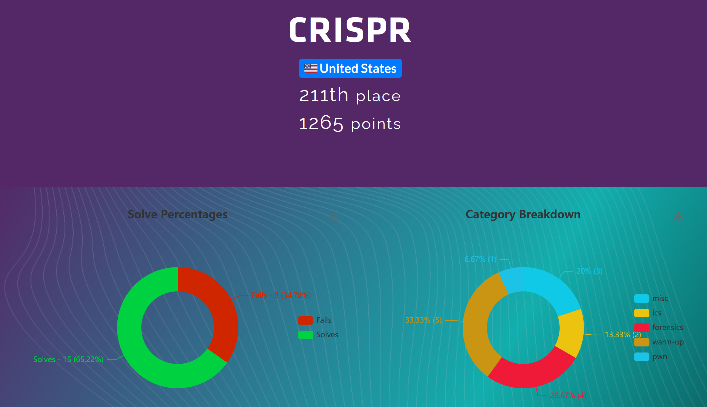

# CSAW 2021 Writeups       

| Challenge | Category | Solved by|
| ----------- | ----------- | ----------- |
| [The Magic Modbus](https://github.com/CR15PR/CSAW2021/tree/main/ics/Magic_modbus) | ics | root2thrill |
| [Lazy Leaks](https://github.com/CR15PR/CSAW2021/tree/main/forensics/Lazy_Leaks) | Forensics | root2thrill |
| [Poem Collection](https://github.com/CR15PR/CSAW2021/tree/main/warm-up/poem-collection) | warm-up | root2thrill |
| [Turing](https://github.com/CR15PR/CSAW2021/tree/main/warm-up/Turing) | warm-up | root2thrill |
| [Password Checker](https://github.com/CR15PR/CSAW2021/tree/main/warm-up/Password_Checker) | warm-up | dancing.pickle |
| [checker](https://github.com/CR15PR/CSAW2021/tree/main/warm-up/checker) | warm-up | root2thrill |
| [Weak Password](https://github.com/CR15PR/CSAW2021/tree/main/misc/Weak_password) | misc | root2thrill |
| [Sonicgraphy Fallout](https://github.com/CR15PR/CSAW2021/tree/main/forensics/Sonicgraphy_fallout) | Forensics | root2thrill |
| [a pain in the BAC(net)](https://github.com/CR15PR/CSAW2021/tree/main/ics/A_Pain_in_the_BAC%7Bnet) | ics | root2thrill |
| [Alien Math](https://github.com/CR15PR/CSAW2021/tree/main/pwn/Alien_math) | pwn | dancing.pickle |
| [mic](https://github.com/CR15PR/CSAW2021/tree/main/forensics/mic) | forensics | dancing.pickle |
| [Contact Us](https://github.com/CR15PR/CSAW2021/tree/main/forensics/Contact_Us) | forensics | dancing.pickle |
| [Crack Me](https://github.com/CR15PR/CSAW2021/tree/main/warm-up/Crack_me) | warm-up | root2thrill |

Notes:

