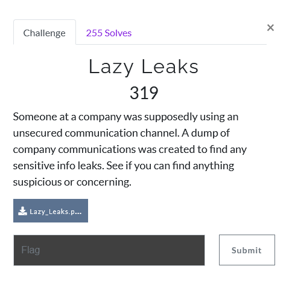
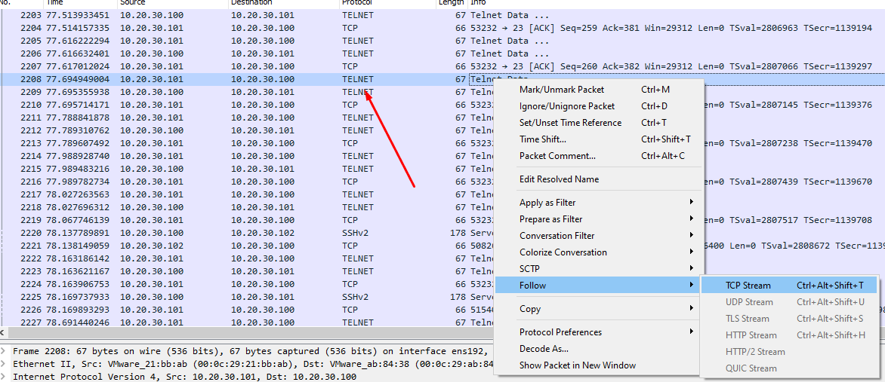
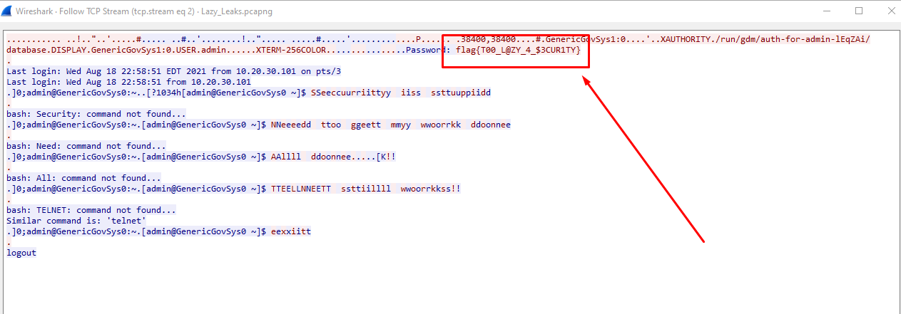

# Lazy Leaks

1) provided a PCAP file i looked at unsecure communication. AKA non-encrypted. The first protocol that jumped out at me was TELNET

2) right click > Follow > TCP Stream

3) We got the flag!

- `flag{T00_L@ZY_4_$3CUR1TY}`
