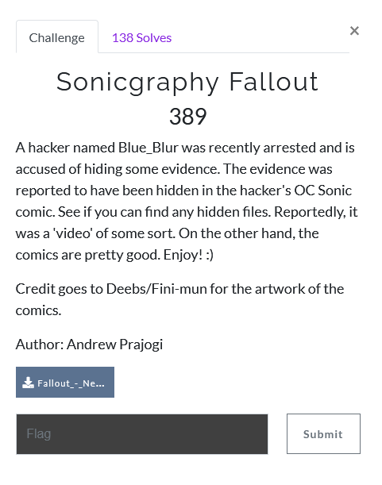
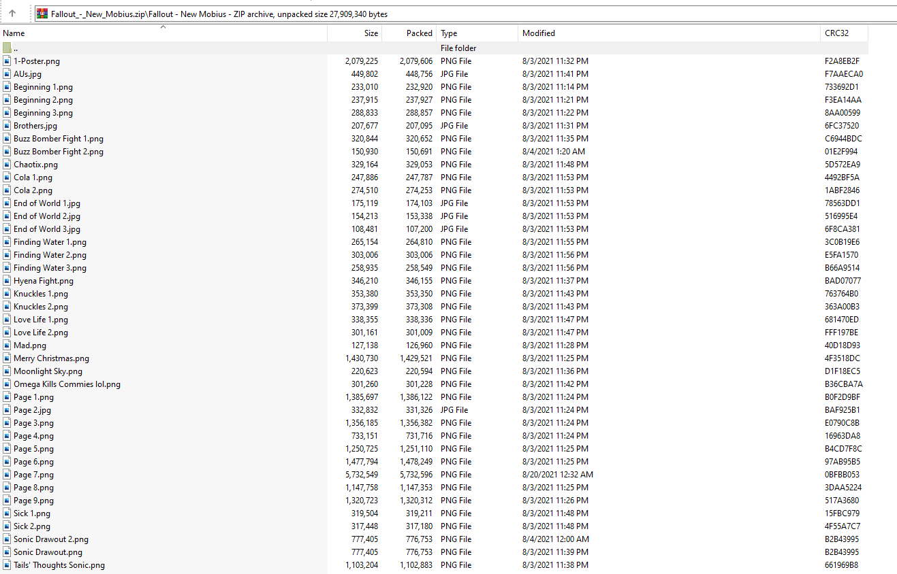
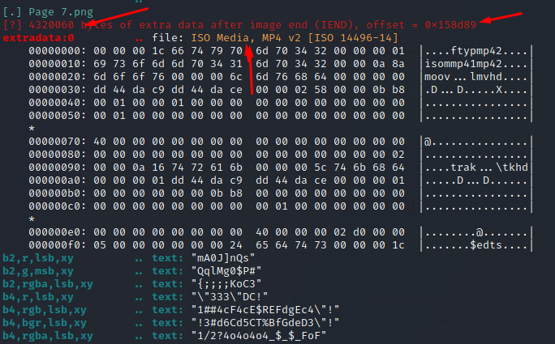
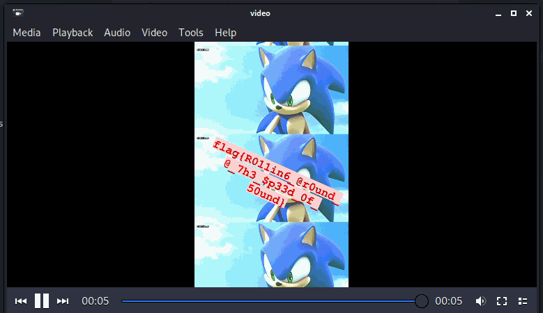

# Sonicgraphy Fallout

1) We are given a zip file with 40 files, all pictures. all .jpg or .png. one of them has a hidden video.

2) `unzip Fallout_-New_Mobius.zip`

3) use zsteg on all of them to look for hidden files `zsteg *`

4) We see an .mp4 file in Page 7 at offset 0x158d89 and size 4320060

5) remove it with dd
 - `dd bs=1 skip=1412489 count=4320060 if=Page\ 7.png of=video`
  - `bs=1` byte size 1 (1 byte at a time)
  - `skip=1412489` skip to the specified offset 0x158d89 (dd takes decimals)
  - `count=4320060` extract that many bytes
  - `if=Page\ 7.png` input file is "Page 7.png"
  - `of=video` output to a file named video

6) open it with a media player

