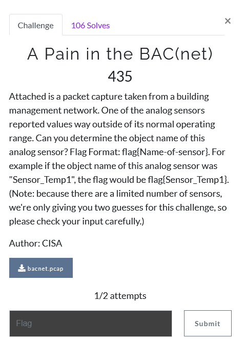

# A Pain in the BAC(net)

1) given a .pcap file, look through the sensors and find the one with some anamalous data

2) open the .pcap in wireshark and look around.

3) the question specifies we are looking for an "analog sensor".
 - looking in wiresharks display filters we can filter for the values of these sensors with `bacapp.present_value.real`

4) Now we only see a small 160 packet capture of each of the 8 sensors. They vary in measurements from KG, Lumens, Liters, etc
 - looking at packets one by one, most values of a single sensor don't change by more than +-10%. however the one measuring lumens jumps from ~1400 lumens to 9999 at packet 2033

5) this sensor is named "Sensor_12345". `flag{Sensor_12345}`

