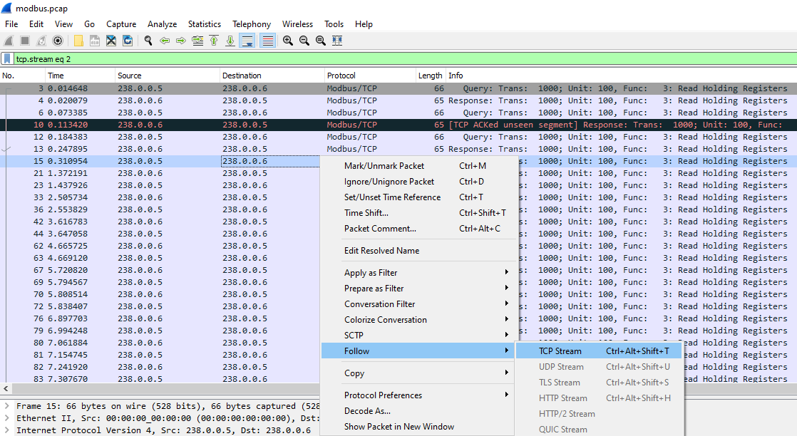
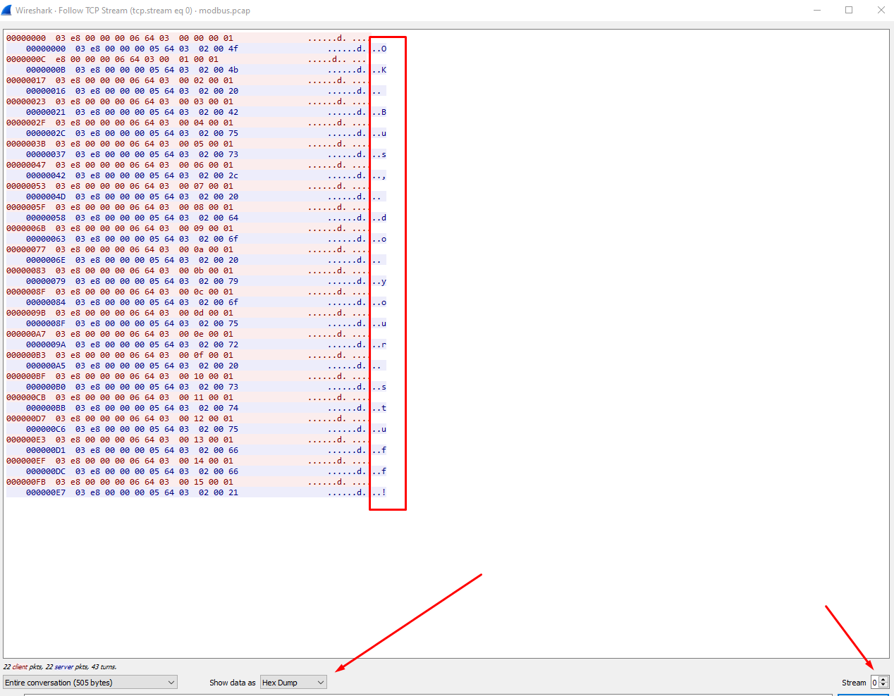
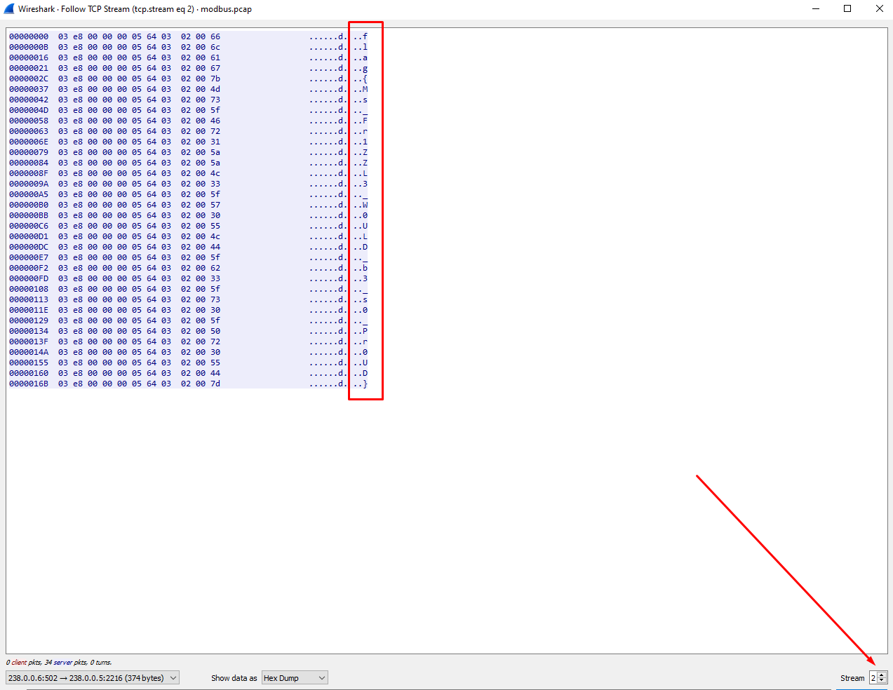

# The Magic Modbus

1) view the pcap file in wireshark
- 

2) right click a packet > Follow > TCP Steam
- 
- interesting, it's a message.  Changing the TCP Stream to stream 2 reveals the flag

3) 
- `flag{Ms_Fr1ZZL3_W0ULD_b3_s0_Pr0UD}`
