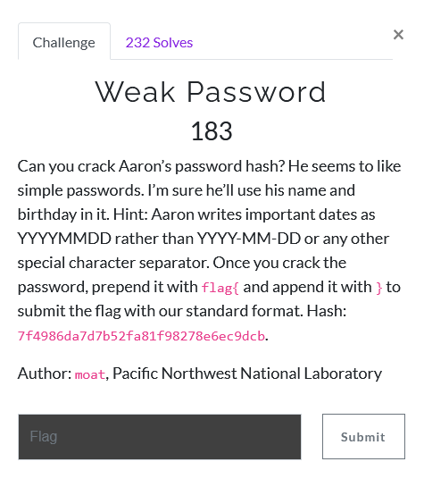
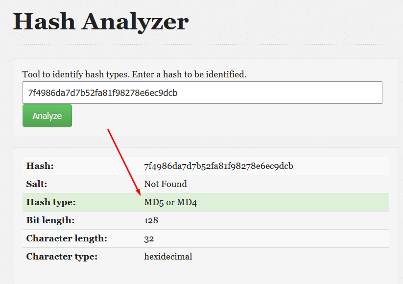
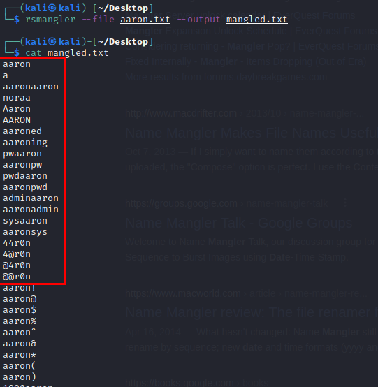
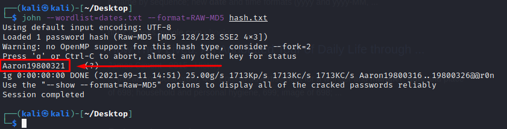

# Weak_password



1) ok, so from the question its clear we need to crack his hash and we are given a hint that the password contains his name and a date in they `YYYYMMDD` format. Quickly the steps to do this are:
 - identify the hash type
 - make a wordlist for all possible combinations of his name and date in the specified format
 - input it into John The Ripper and crack the hash

### Checking the hash type

1) go to [an online hash analyzer](https://www.tunnelsup.com/hash-analyzer/) and input the hash



- looks like it's MD5

### Making the wordlist

1) the wordlist must contains the dates in the `YYYYMMDD` format.  I started from 1970 and went through 2021 for my range and generated it with my python script [dategen.py](dategen.py).

2) additionally i added an array of mangled versions of "aaron"
 - `echo "aaron" > aaron.txt`
 - `rsmangler --file aaron.txt --output mangled.txt`
 - `cat mangled.txt`

 

 - i took most of the highlighted values and prepended/appended them to each date in my [dategen.py](dategen.py) script

3) run the script

```
year= 1970

mangler = ["aaron","aaronaaron","noraa","Aaron","AARON","44r0n","4@r0n","@4r0n","@@r0n"]

with open("dates.txt", "w") as dates:
    while year < 2022:
        month = 1
        while month < 13:
            day=1
            while day < 32:
                daystr = f"{day:02d}"
                monstr = f"{month:02d}"
                yearstr = str(year)
                for i in mangler:
                    dates.write(i+yearstr+monstr+daystr+"\n")
                    dates.write(yearstr+monstr+daystr+i+"\n")
                day+=1
            month +=1
        year +=1
```

### Crack the Hash

- `echo "7f4986da7d7b52fa81f98278e6ec9dcb" > hash.txt`
- `john --wordlist=dates.txt --format=RAW-MD5 hash.txt`



- `flag{Aaron19800321}` i suppose the mangler wasn't necessary, but its still good practice
