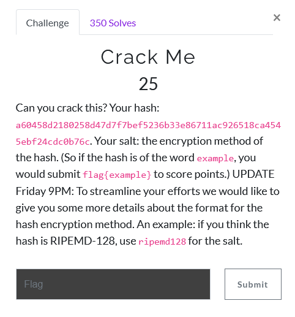

# Crack Me

1) pretty straightforward, just crack the hash provided using a known salt.

2) find the salt
 - input the hash into an [online hash analyzer](https://www.tunnelsup.com/hash-analyzer/)
 - 
 - salt is `sha256`

### crack the hash with John the Ripper
1) `john --list=subformats | grep sha256`
  - 
  - we will be using `dynamic_61`

2)  `echo "username:a60458d2180258d47d7f7bef5236b33e86711ac926518ca4545ebf24cdc0b76c$sha256" > crack.txt`

3) `john --format=dynamic_61 --wordlist=/usr/share/wordlists/rockyou.txt crack.txt`

4) password is `cathouse`
