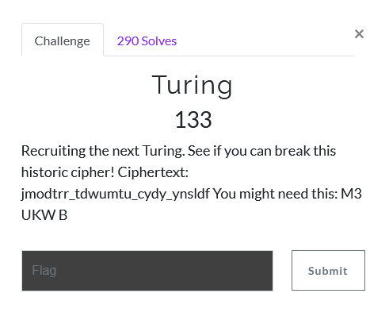
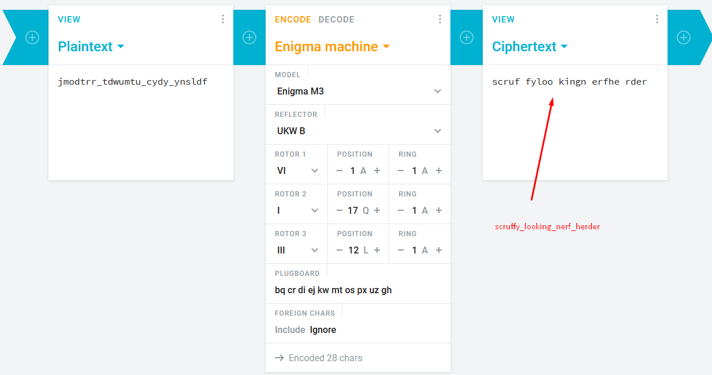

# Turing

1) Turing implies the challenge is about [Alan Turing](https://en.wikipedia.org/wiki/Alan_Turing). He is most known for his work in cryptography that led to the Allies cracking the Enigma machine and the subsequent birth of modern computing.  

2) looking at the ciphertext one can assume it's a substitution cipher

3) reading the hint "M3 UKW B" and googling it shows they are enigma settings

4) go to [an online engima decoder](https://cryptii.com/pipes/enigma-machine) and input the ciphertext to get the flag
 - note: not sure if it was intentional or not that the default settings here were set the same as the flag encryption

 
