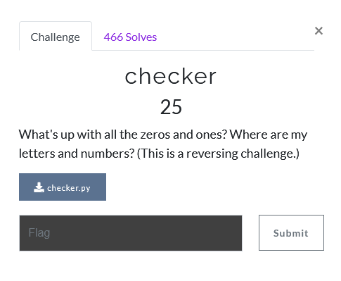
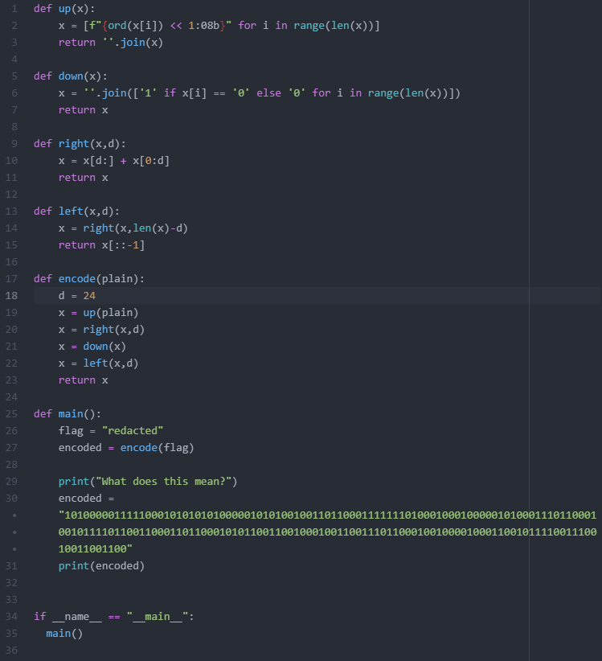
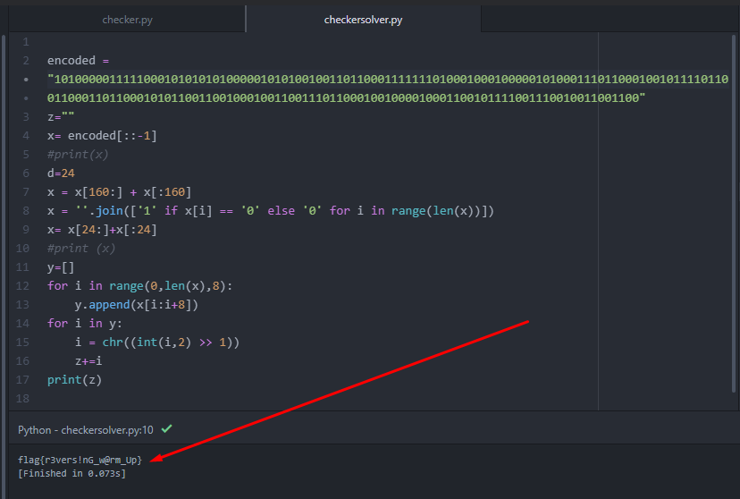

# Checker

files: [checker.py](checker.py)

1) reading the .py file

- 

2) so the goal is to just do all the functions in reverse. Some of the functions you have to modify a bit (such as the bitshift in "up"). i left my scratch work in [checkertester](checkertester.py), but this one can all be done with a trial and error with prints even if your python skills aren't strong.

3) one by one i went through the functions backwards and annotated what they did and made a new python file that does the opposite [checkersolver.py](checkersolver.py)

4) 
