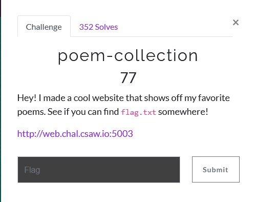
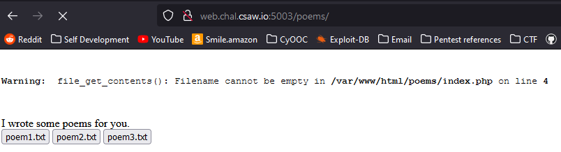
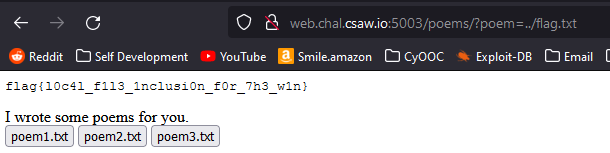

# Poem Collection

1) following the link takes us to a site with a link to directory `/poems`

2) 

3) clicking a poem changes the URL to the file we chose.
 - 
 - what happens if we change it the poem argument to `flag.txt`?

4) `web.chal.csaw.io:5003/poems/?poem=flag.txt`
 - gives error of file not found

5) lets try the next directory up `../flag.txt`

- We got the Flag! `flag{l0c4l_f1l3_1nclusi0n_f0r_7h3_w1n}`
